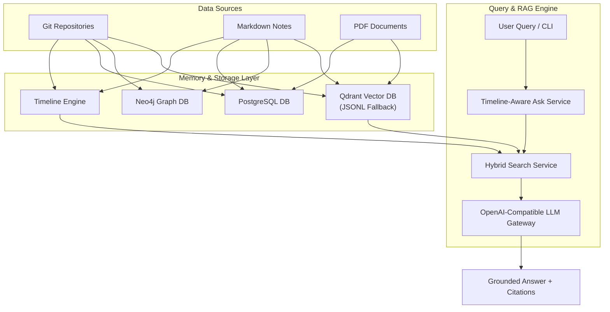

# EchoMind

A personal AI memory system that connects information from different sources and answers questions using grounded retrieval.

[](#)
[](#)
[](#)

---

## Overview

EchoMind is a personal knowledge and memory service designed to bridge dispersed information across software development environments, local documents, and personal note repositories.

Developers and teams generate fragmented knowledge daily—stored across git commits, project documentation, code changes, and markdown notes. Traditional search engines match keywords, while generic AI chat tools lack contextual awareness of individual work history.

EchoMind ingests digital artifacts from multiple local and external sources, extracts structural relationships, and builds a chronological memory timeline. When queried, EchoMind retrieves grounded evidence from code, commits, and notes to formulate precise answers with source references.

---

## Documentation Index

Detailed documentation for EchoMind is organized into modular guides:

- 🏗️ **[Architecture Guide](docs/architecture.md)**: System design, data flow, component breakdown, and Mermaid diagrams.
- ⚡ **[Installation Guide](docs/installation.md)**: Prerequisites, environment setup, and Docker Compose configuration.
- ⚙️ **[Configuration Reference](docs/configuration.md)**: Environment settings, model provider matrix, and database settings.
- 🔌 **[Supported Connectors](docs/connectors.md)**: Git, Markdown Notes, PDF, and planned memory source integration details.
- 💻 **[API & CLI Reference](docs/api.md)**: Command-line utilities (`ask`, `timeline`, `git_index`, `notes_index`, `verify_llm`) and API specifications.
- 🗺️ **[Project Roadmap](docs/roadmap.md)**: Completed milestones, work in progress, and planned developments.
- 🛠️ **[Development & Contributing](docs/development.md)**: Engineering principles, dependency injection patterns, and contributor guidelines.

---

## Quick Start

### Installation

```bash
# Clone the repository
git clone https://github.com/Anshmaan29/EchoMind.git
cd EchoMind

# Setup virtual environment and install backend
python3 -m venv .venv
source .venv/bin/activate
cd backend
pip install -e .

# Configure environment
cp .env.example .env
```

### Basic Usage

Query your personal memory using the Ask CLI interface:

```bash
# Ask a question over ingested work history
python -m app.cli.ask --query "What did I work on today?"

# View chronological activity timeline
python -m app.cli.timeline --today

# Index project notes
python -m app.cli.notes_index
```

For full installation details, see the **[Installation Guide](docs/installation.md)** and **[CLI Reference](docs/api.md)**.

---

## Architecture Overview



For detailed component descriptions and pipeline sequence diagrams, see the **[Architecture Guide](docs/architecture.md)**.

---

## Supported Memory Sources

| Source | Status | Description |
| :--- | :--- | :--- |
| **Git Repositories** | Supported | Indexes commit history, modified files, diff stats, and author details. |
| **Personal Notes** | Supported | Recursively indexes Markdown (`.md`) and text (`.txt`) note files. |
| **PDF Documents** | Supported | Extracts body text, metadata, and document layout. |
| **Markdown Files** | Supported | Indexes section headings, tags, and internal wiki links. |
| **WhatsApp Exports** | Planned | Import pipeline for chat history transcripts. |
| **Audio Files** | Planned | Speech-to-text processing for voice recordings. |
| **Gmail / Calendar** | Planned | Connectors for email threads and calendar events. |

For connector implementation details, see the **[Connectors Guide](docs/connectors.md)**.

---

## Tech Stack Summary

| Component | Technology |
| :--- | :--- |
| **Language** | Python 3.11+ |
| **Framework** | FastAPI (Async HTTP API) |
| **Databases** | PostgreSQL 16, Qdrant (Vector DB), Neo4j (Graph DB) |
| **Embedding Models** | Qwen3-Embedding-8B, BAAI/bge-m3, OpenAI text-embedding-3, Mock |
| **LLM Gateway** | OpenAI Chat Completions API, Local Hugging Face / vLLM, Mock Provider |

---

## License

Distributed under the MIT License. See `LICENSE` for details.

---

## Acknowledgements

- **FastAPI**: Async web framework.
- **Qdrant**: Vector search engine.
- **Neo4j**: Graph database platform.
- **PyTorch & Transformers**: Machine learning runtime and model loading libraries.
- **Qwen**: Open-weights embedding model family by Alibaba Cloud.
