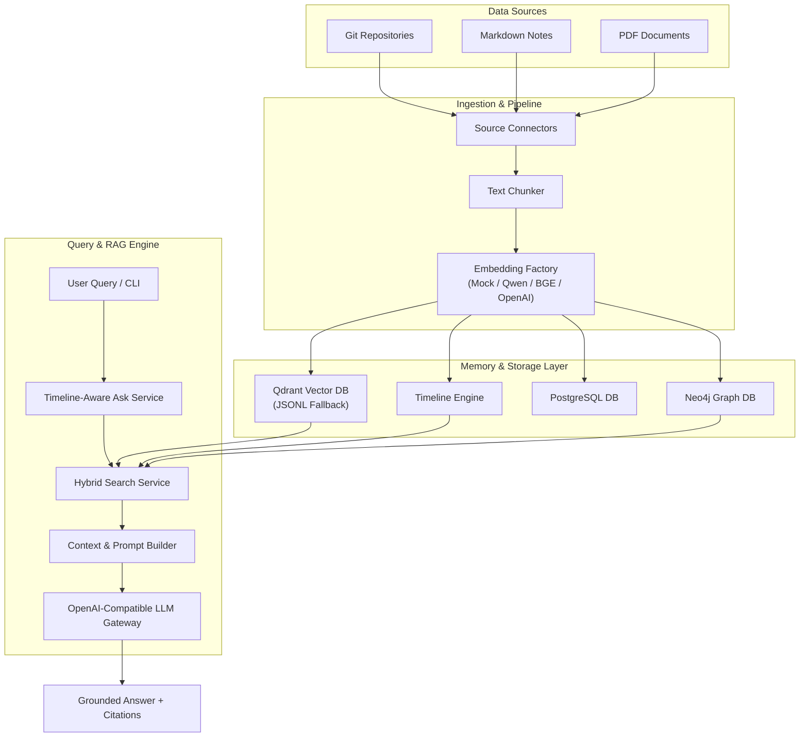

# Architecture Guide

EchoMind is designed as a modular personal AI memory system. It ingests digital artifacts across development environments and personal documentation, constructs a temporal knowledge graph, and provides grounded evidence retrieval for LLM question answering.

---

## High-Level Data Flow

---

## Core Architecture Components

### 1. Ingestion Engine & Connectors
- **GitConnector**: Scans repository history, commit messages, modified files, diff statistics, and author timestamps.
- **NoteConnector**: Recursively scans note directories for `.md` and `.txt` files, extracting frontmatter tags, internal Markdown links, and headings.
- **PDFLoader & PDFParser**: Processes binary PDF documents and extracts body text and metadata.

### 2. Embedding Factory & Pipeline
- **EmbeddingFactory**: Instantiates configured embedding providers (`Qwen/Qwen3-Embedding-8B`, `BAAI/bge-m3`, `OpenAI`, `Mock`) using provider-native vector dimensions (Mock: 384, Qwen: 4096, OpenAI: 1536, BGE: 1024).
- **GenericEmbeddingPipeline**: Manages async batch embedding generation, failure checkpoints (`CheckpointManager`), and fallback JSONL exports (`JSONLBackupWriter`).

### 3. Dual Storage & Timeline Engine
- **Vector Store (`QdrantVectorStore`)**: High-performance vector indexing in Qdrant with seamless local JSONL fallback during standalone operations.
- **Knowledge Graph (`Neo4jGraphStore`)**: Property graph tracking entity types, relationships, and source document links.
- **Timeline Engine (`TimelineService`)**: Aggregates chronological events across git commits, notes updates, and document ingestions to answer temporal queries ("What did I work on today?").

### 4. Hybrid Retrieval & LLM Gateway
- **SearchService**: Blends dense vector cosine similarity (55% score weight) with BM25 keyword matching and structural file path re-ranking.
- **LLM Gateway (`LLMFactory`)**: Provider abstraction connecting `AskService` and `PromptBuilder` to Mock or OpenAI-compatible HTTP endpoints (OpenAI API, vLLM, Ollama, AI Kosh).

---

## References

- [Installation Guide](installation.md)
- [Configuration Reference](configuration.md)
- [Connectors Overview](connectors.md)
- [API & CLI Reference](api.md)
